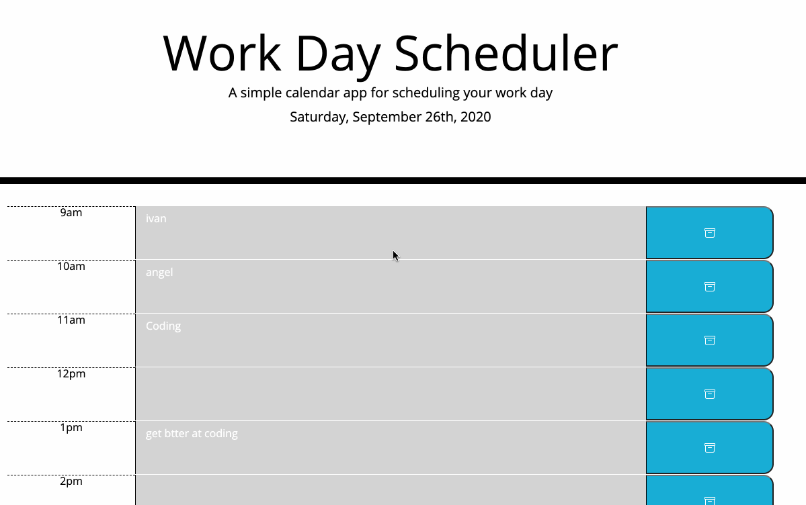

# Work-Schedule-Ivan

## Description 
Welcome to your own personal Day Work Shedule. That's right, now you can be orginized and know exactly what you are going to do two hours from now. As long as you stay between the hours of 9 and ten. He you will be presented with page, the current day and text areas where you can write out your day and save your plans for work. You start by writing out your plans and everytime you want to save that specific plan then you press the blue button to the right with the cool icon. wallah, you have saved your plans permenantly until you decide to change them. 

## Technologies
* [JavaScript](https://www.w3schools.com/js/)
* [Bootstrap](https://getbootstrap.com/)
* [jQuery](https://jquery.com/)
* [momentsjs](https://momentjs.com/)

## Features
* Gif of my Website. 



* This code uses a for loop to check the values of every time block, the using the current time to compare. Then depending on the time it will add a class of past, present. or future. 
```
  for (i = 0; i < timeValue.length; i++) {
    var hour = parseInt(timeValue[i].getAttribute("value"));
    if (hour == currentTime) {
      timeValue[i].classList.add("present");
    } else if (hour < currentTime) {
        timeValue[i].classList.add("past");
    } else {
        timeValue[i].classList.add("future");
    }

  }
  ```


* This code will take the text in textarea, I googled and found a way to read the sibling of the button, being text area. Then I took the value of it and set that value to the local storage, using the attricute "value" as it's key. That way every time block has it's own key. 

```
 $(".saveBtn").on("click", function () {
    var timeBlock = $(this).siblings("textarea")[0];
    var task = timeBlock.value;
    var hour = timeBlock.getAttribute("value");
    localStorage.setItem(hour, task);
  });
```
* This code gets the local storage looking for it's key using a for loop. Since every key has a number value, it takes it's key every time the look runs. Then I set the value of the key to the text area. That way when you refresh you still have your items saved. 
```
  for (i = 9; i < 18; i++) {
    var task = localStorage.getItem(i.toString());
   var value = $("[value="+i.toString()+"]");
   
   if (task === null) {
       value.text("")
   } else {
       value.text(task);
   }
  }
});

```

## Author
Ivan Torres
* [Deployed-Link](https://ivantorresmia.github.io/Work-Schedule-Ivan/)
* [GitHub-Repo](https://github.com/IvanTorresMia/Work-Schedule-Ivan)
* [linkedIn](www.linkedin.com/in/ivan-torres-0828931b2)

## Credits
* Credits for this homework assignment go out to Jerome, Manuel, Kerwin, Roger, and all of my classmates who helped me in study sessions. As well as my tutor who helped me a ton with understanding this homework assignment. 
* [StackOverFlow](https://stackoverflow.com/)


## License]
[MIT](https://choosealicense.com/licenses/mit/#) license 